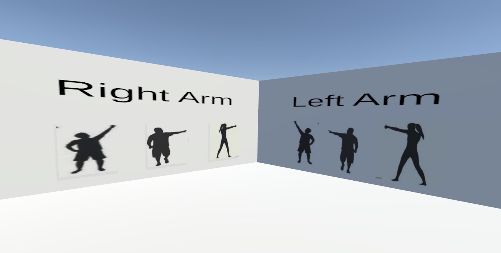
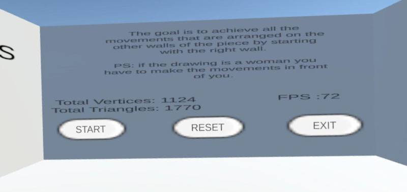
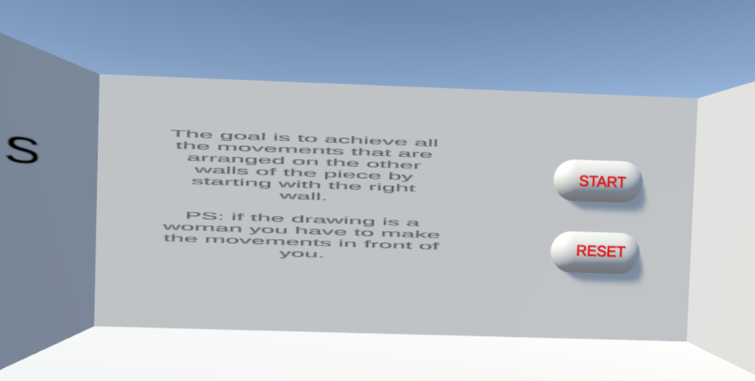

# Internship 2023
## Facilitation Applications
This project was carried out during my second-year internship at University College Dublin, UCD. Its aim is to create two virtual reality applications that teach user movements. They are developed using Unity and VRChat with Unity's assistance. The two applications were created for the purpose of comparing their implementation. This comparison resulted in a published scientific paper, the link to which is [here][papier].

You'll find two folders in this GitHub repository:
- Facilitation Unity: corresponds to the creation of the application in Unity.
- Facilitator VRChat: corresponds to the creation of the application deployed on VRChat.

## Installation
To use the application deployed on VRChat, you first need to install the VRChat SDK, which is used within Unity: [VRChat SDK][VRChat].
Both applications were coded using Unity version [2022.3.6f1][version]. This version aligns with the one supported by the VRChat SDK.

For both applications:
- Download the Project: Clone or download the project from the corresponding directory.
- Open in Unity: Launch Unity and open the project to explore the game's assets, scripts, and scenes.

For testing:
- VRChat application: You can launch VRChat directly from Unity. You just need to have an account on VRChat to access the platform.
- Unity Application: Simply press play, and the application will launch automatically.

**To use the application in Unity, you need to have a Meta headset.**
   
## Exemple
The following images correspond to those taken from the application coded solely in Unity. 

The application deployed on VRChat looks the same visually, only the buttons change

## Auteurs

This project was proposed to me by Assistant Professor Abraham Campbell. The writing of the scientific article was a collaboration between Loane Becel, Abraham Campbell, and myself, and it is available [here][papier].

[papier]: https://ieeexplore.ieee.org/abstract/document/10390043/
[VRChat]: https://creators.vrchat.com/sdk/
[version]: https://unity.com/releases/editor/archive
